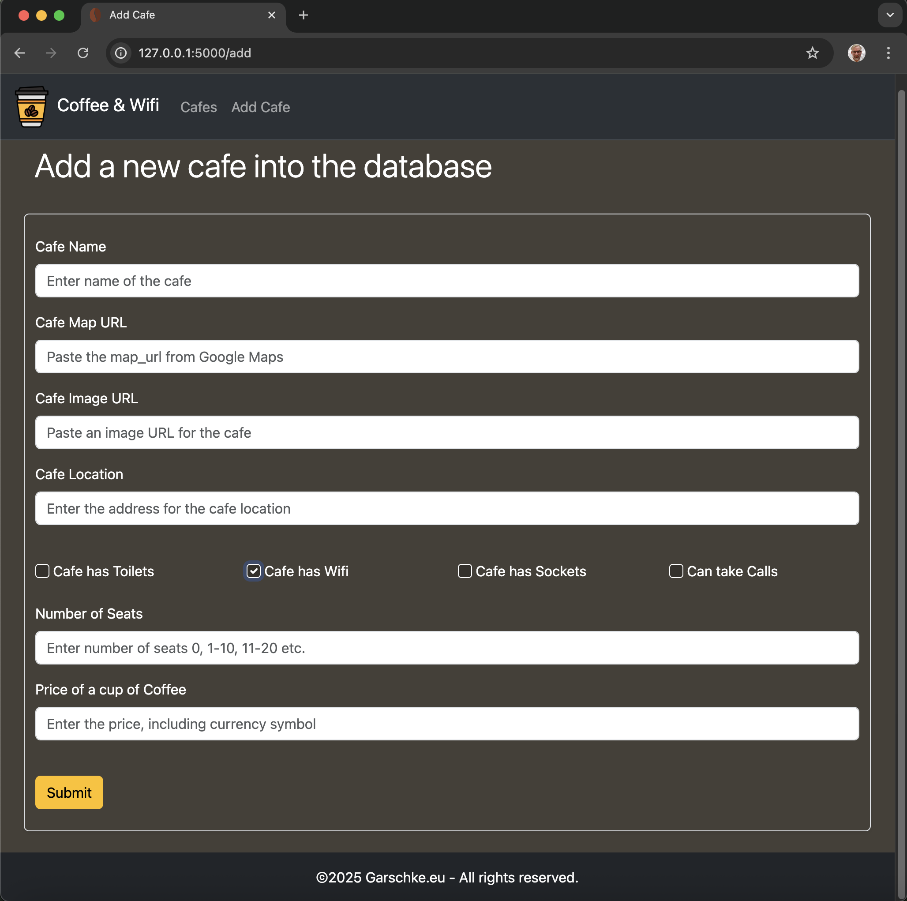

# cafe_wifi
Website that lists cafes with wifi and power for remote working. Using Python with Flask, SQLAlchemy and Bootstrap 5.3 to create simple responsive website connected to a SQLite DB. Utalizing custom external CSS and inline CSS to add additional control of a coffee inspired color pallet.

The website landing page is designed to highlight Brand identity and purpose. Small details like a custom coffee bean favicon, custom fonts and color pallet, provide an introduction to the consistent design feel and look, which is carried on throughout the site.

The link on the lading page takes you to the main 'Cafes' page, listing the cafes, each cafe in it's own section.  Using custom fonts, from font-awesome, for icons, the amenities at each cafe can clearly be seen, from Wifi, Sockets and Seats through to if the cafe has toilets available for customer. 
Navigating the site is via the Navigation Bar at the top of the screen; again tying back to the brand identity, with a small coffee cup logo from the landing page repeated at the right of the bar, and consistant fonts and color pallet. 
The three links in the navigation bar are for: the landing page, the cafes page and add-cafe pages. For cafe specific links there are: Edit Cafe, Delete (cafe), and Maps; these details buttons are in the individual cafe sections.  The 'Maps' button opens a new browser tab containing the linked Google Maps page, 

In the individual cafe sections, under the Cafe name and location, the icons and text give quick visual guide to facilities, with available facilities in high contrast white, and unavailable facilities having icons and text rendered in a faint tonal color blending into the background color, as well as having strikethrough font embelishment for the text. Below the text you have the buttons for Edit Cafe and Delete. 
The Navigartion bar 'Add Cafe' link and 'Edit Cafe' button, take you to dedicated, consitantly themed and designed pages, with forms to gather the cafe details.

The forms on both of these pages, use client side validation, to ensure that details are filled in, and are of the correct type, whether that is text or URLs, before they can be submitted. Check boxes are used to gather info on if the cafe has Toilets, Wifi, Power Sockets and if you can Take Calls. These checkes use inline CSS to override the regular and Bootstrap formatting to keep a consistant color pallet.  If fields are missed or incorrect input tyopes are used, the feedback is provided.

For all of the text fields an input is required, if the fields is left blank then a message '!Please fill out this field' is displayed. 
 

 
 
In addition to the fields needing to be filled in, there are two URL fields, for the Map and Image, that must not just have some text, but that text needs to comply with the rule for a URL, if text other than a URL is entered a message is displayed '!Please enter a URL'. 
 

<!-- FEATURES -->
## Features

- Bootstrap 5.3 used to deliver consistant responsive cross browser rendering of the pages.
- Custom CSS (external and inline) used to adjust out of the box color pallet.
- Flask used to build and render pages from Python and inject the current year's date into the copyright at bottom of the page.
- Client side Data Validation in the HTML form pages.
- Custom coffee inspired color pallet.
  - #454038
  - #825F27
  - #69311F
  - #573A0C
  - #FFC107
  - #FFFFFF
 
  
 

- DB validation to ensure duplicate Cafes are not aded to the databse with test for unique Cafe Name.
  

